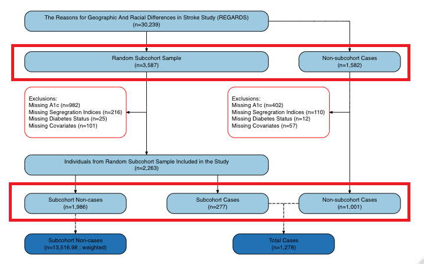
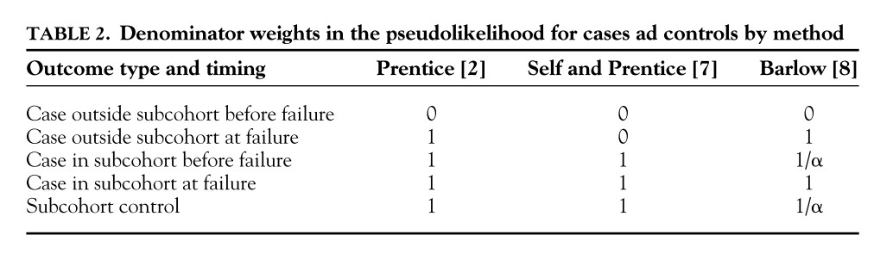

```{r setup, include=FALSE}
knitr::opts_chunk$set(echo = TRUE)
```

# TL;DR
* Case-cohort, a special case of case-control, is designed for accurate estimation of risk when analyzing time-to-event outcome.
  * Only use random sub-cohort part of data for accurate odds ratio estimation
* Case-cohort study consists three parts:
  * Random Sub-cohort: _sub-cohort cases_ and _sub-cohort non-cases_
  * _Non sub-cohort cases_
* Use sampling weight when doing analysis
  * _Denominator Weights_ need to be calculated for cases
* When the case definition changes, your analytic dataset changes
  * REGARDS used stratification when random sampling the sub-cohort part. Hence, there are multiple case-cohort studies where the _survey weights_ are different
  * Do not change your sub-cohort sample


# Motivation

* The purpose for customized study designs is mostly for accurate estimation of a statistics (mean or measure of association)
  * Golden standard: cohort study
* The cohort design is not efficient for studying outcomes that are rear or has long follow-up
  * Case-control design
* Many types of case-control designs, depending on how controls are sampled
  * Case-cohort is a special case of case-control
* A big part of data collected in the case-cohort design, the random sub-cohort, can be repeatedly used when studying other definitions of cases.

# Study Design



## Logistics
* At baseline
  * Collect blood sample for all participants and store in a freezer
  * Create random sub-cohort ^{This step can be also done retrospectively}

* At the time of case-cohort study
  * Define cases and assemble the analytic dataset
  * Analyze the blood sample for the analytic dataset
  * Run analysis

# Analysis
## Odds Ratio
* Use the random sub-cohort data to analyze

## Survival Analysis
* Define _Denominator Weights_ following


# Cautious 
* Different from nested cohort design
* Define your cohort clearly
  * Sampling the random subcohort before/after exclusion of sample makes different to the estimation
  * Most often, REGARDS have pre-defined random sub-cohort. Don't do it on your own.
* 

# Methodology Development
* Linear regression in a case-cohort study: interpretation and statistical inference
* Bootstraping strategies in a case-cohort study and its implications on mediation analysis
